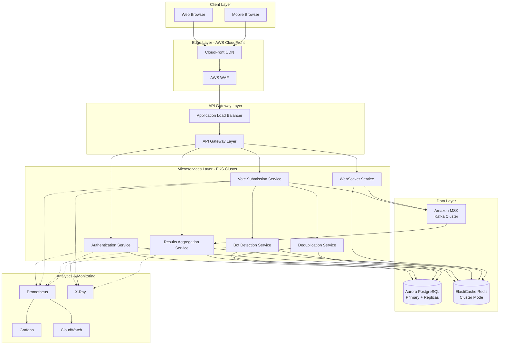
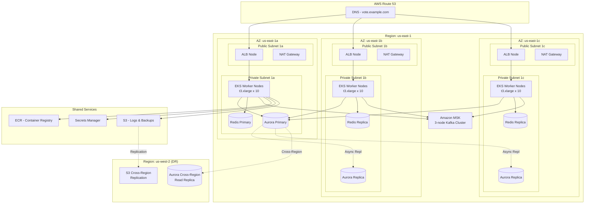
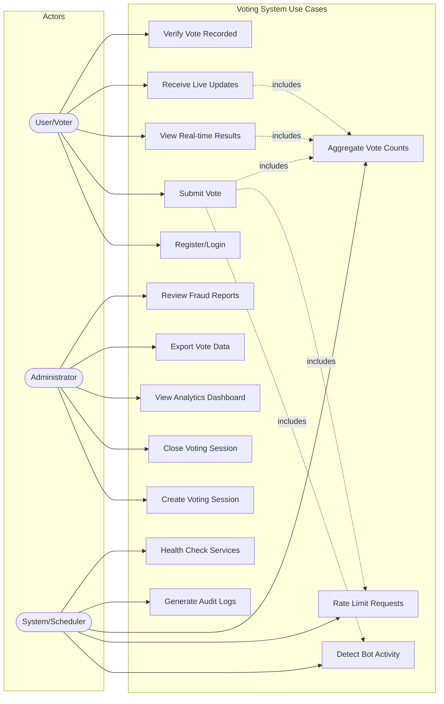
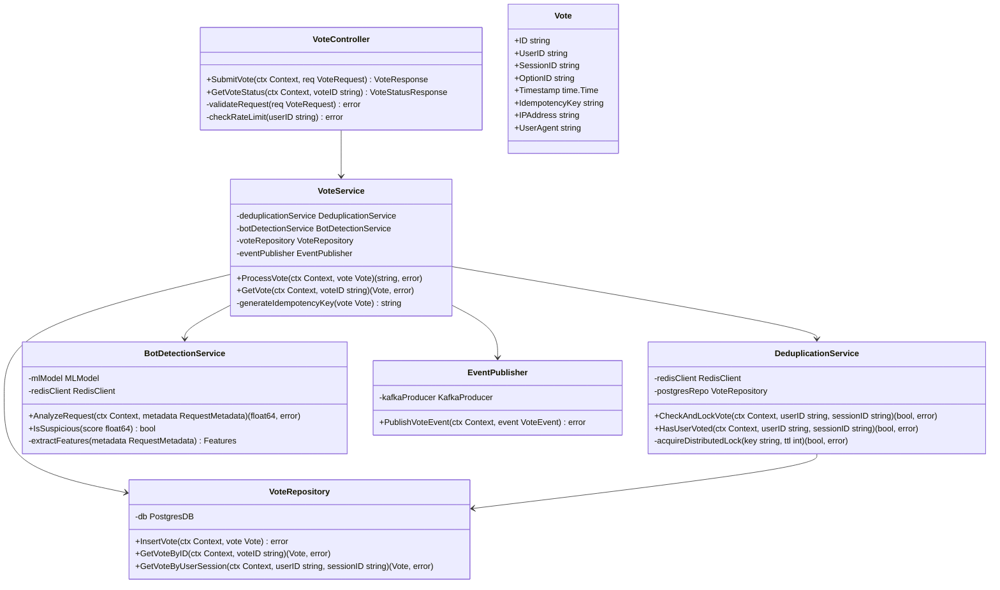
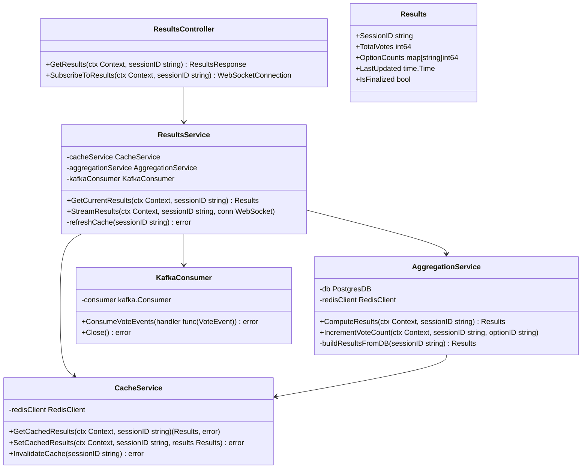
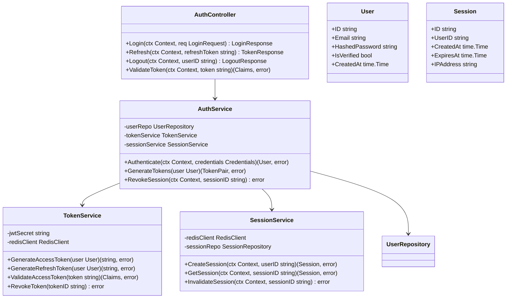

# 🧬 Template

This is a template created by Diego Pacheco which the goal to better describe a tought process which is called architecture. This should be used to learn software architecture and to pratice with use cases.

## 🏛️ Structure

### 1. 🎯 Problem Statement and Context

What is the problem? What is the context of the problem?

You must design a realtime voting system with the following requirements:
- Never lose data
- Be secure and prevent bots and bad actors
- Handle 300M users
- Handle peak of 250k RPS
- Must ensure users vote only once
- Should be realtime

Restrictions:
- No serverless
- No MongoDB
- No on-premise, GCP or Azure
- No Openshift
- No mainframes
- No monolithic solutions

### 2. 🎯 Goals

```
1. Ultra-High Performance: Handle 250k RPS at peak with p99 latency under 100ms for vote submission and under 500ms for realtime results aggregation.
2. Absolute Data Durability: Zero vote loss under any circumstance - implement write-ahead logging, multi-region replication, and point-in-time recovery.
3. Bulletproof Security: Implement multi-layer bot detection (rate limiting, CAPTCHA, device fingerprinting, ML-based anomaly detection), encryption at-rest and in-transit (TLS 1.3), and undergo penetration testing.
4. Strict Vote Uniqueness: Guarantee exactly-once voting per user using distributed locks, idempotency keys, and database unique constraints with conflict resolution.
5. True Realtime Experience: Deliver vote results with sub-second latency using event streaming, materialized views, and WebSocket connections for live updates.
6. Massive Horizontal Scalability: Design stateless microservices that can scale to 300M users across multiple AWS regions with auto-scaling based on metrics.
7. Cloud-Native Architecture: Leverage AWS managed services (RDS, ElastiCache, ECS/EKS, SQS/SNS) with infrastructure-as-code and immutable deployments.
8. Observability: Distributed tracing (X-Ray), logging (CloudWatch), metrics (Prometheus/Grafana).
9. Resilience and Fault Tolerance: Implement circuit breakers, bulkheads, retry with exponential backoff, graceful degradation, and chaos engineering practices.
10. Microservices Modularity: Design independent, loosely-coupled services with well-defined APIs, allowing teams to deploy and scale components independently.
```
Recommended Learning: [Education vs Learning](http://diego-pacheco.blogspot.com/2020/05/education-vs-learning.html)

### 3. 🎯 Non-Goals

```
1. Serverless Architecture: Despite cloud-native goals, we explicitly avoid Lambda/serverless due to cold starts, unpredictable latency, and inability to maintain persistent connections for realtime features.
2. MongoDB or NoSQL Document Stores: MongoDB is explicitly restricted, and we avoid document databases that sacrifice ACID guarantees needed for vote counting accuracy.
3. Multi-Cloud Support: Focus solely on AWS - no GCP, Azure, or on-premise support. Cloud-agnostic abstractions add complexity without business value for this use case.
4. Perfect Availability: We target 99.99% uptime, not 100%. Planned maintenance windows and graceful degradation are acceptable over extreme complexity.
5. Complex Blockchain/Consensus: While vote integrity is critical, we avoid blockchain or complex consensus protocols (Paxos/Raft beyond managed services) due to performance overhead.
6. Real-time Analytics/BI: Realtime vote counts are required, but complex analytics dashboards, historical trending, and data warehousing are out of scope.
7. Mobile Native Apps: Focus on web-first responsive design. No native iOS/Android apps, though mobile web must be fully functional.
8. Automated Rollback for Everything: Critical failures need manual intervention and analysis. Not everything should auto-rollback to prevent cascading issues.
9. Cost Optimization at All Costs: Performance and reliability take precedence over cost. We won't compromise on redundancy or over-provisioning for peak capacity.
```
Recommended Reading: [Requirements are dangerous](http://diego-pacheco.blogspot.com/2021/01/requirements-are-dangerous.html)

### 📐 4. Principles

```
1. Design for Failure: Assume every component can and will fail. Implement timeouts, circuit breakers, bulkheads, and graceful degradation at every service boundary.
2. Idempotency Everywhere: All write operations must be idempotent using idempotency keys. Retries should never cause duplicate votes or inconsistent state.
3. Database as Source of Truth: In-memory caches and streaming systems are for performance, but PostgreSQL/Aurora is the authoritative source for all votes and state.
4. Zero Trust Security: Authenticate and authorize every request. Encrypt all data in transit and at rest. Validate all inputs. Trust no network boundaries.
5. Immutable Infrastructure: Deploy via containers with versioned images. No SSH to production. All changes via CI/CD pipelines with blue-green or canary deployments.
6. Observability First: Instrument before coding. Every API call, database query, and cache operation must emit metrics, logs, and traces for debugging and SLO tracking.
7. Horizontal Scalability Only: Design stateless services that scale horizontally. Avoid vertical scaling dependencies. Use distributed caching and database read replicas.
8. API Contract Stability: Maintain backward compatibility on all APIs. Use versioning (v1, v2). Never break existing clients. Deprecate gracefully with migration periods.
9. Write-Heavy Optimization: Optimize for 250k write RPS during voting windows. Use connection pooling, batch writes where possible, and async processing for non-critical paths.
10. Test in Production Conditions: Load test at 1.5x expected peak (375k RPS). Run chaos experiments in staging. Use feature flags for safe production rollouts.
```
Recommended Reading: [Stability principles](http://diego-pacheco.blogspot.com/2018/01/stability-principles.html)

### 🏗️ 5. Overall Diagrams

Here there will be a bunch of diagrams, to understand the solution.

#### 🗂️ 5.1 Overall Architecture



**Key Components:**
- **Client Layer**: Web/mobile browsers accessing the system
- **Edge Layer**: CloudFront CDN for static assets + AWS WAF for DDoS protection
- **API Gateway**: ALB distributing traffic across service instances
- **Microservices**: 
  - Authentication: JWT-based auth, session management
  - Vote Submission: High-throughput vote ingestion
  - Deduplication: Ensures exactly-once voting per user
  - Results Aggregation: Real-time vote counting
  - Bot Detection: ML-based fraud prevention
  - WebSocket: Live result updates to clients
- **Data Layer**: 
  - Aurora PostgreSQL for durable vote storage
  - Redis for caching, rate limiting, distributed locks
  - Kafka for event streaming and async processing
- **Observability**: Prometheus/Grafana for metrics, CloudWatch for logs, X-Ray for tracing

#### 🗂️ 5.2 Deployment Architecture



**Infrastructure Details:**
- **Multi-AZ Deployment**: 3 availability zones for 99.99% availability
- **Compute**: 
  - EKS Kubernetes cluster with 30 t3.xlarge worker nodes (10 per AZ)
  - Horizontal Pod Autoscaler scaling from 30-100 nodes based on CPU/memory
- **Database**: 
  - Aurora PostgreSQL with 1 writer + 2 reader replicas
  - Cross-region replica in us-west-2 for disaster recovery
- **Caching**: 
  - ElastiCache Redis cluster mode with 3 shards, 2 replicas per shard
- **Messaging**: 
  - Amazon MSK (Kafka) with 3 brokers across 3 AZs
- **Networking**: 
  - Public subnets for ALB and NAT Gateways
  - Private subnets for all compute and data resources
  - VPC peering for cross-region DR

#### 🗂️ 5.3 Use Case Diagram



**Primary Use Cases:**

**User Flows:**
1. **Register/Login**: OAuth2/JWT authentication, session creation
2. **Submit Vote**: Idempotent vote submission with deduplication check
3. **View Real-time Results**: Query current vote counts with <500ms latency
4. **Receive Live Updates**: WebSocket subscription for push notifications
5. **Verify Vote Recorded**: Confirmation receipt with vote ID

**Admin Flows:**
6. **Create Voting Session**: Configure voting options, start/end times
7. **Close Voting Session**: Stop accepting new votes, finalize results
8. **View Analytics Dashboard**: Monitor vote patterns, geographic distribution
9. **Export Vote Data**: Generate audit reports for compliance
10. **Review Fraud Reports**: Investigate flagged suspicious activity

**System Flows:**
11. **Detect Bot Activity**: ML-based anomaly detection, device fingerprinting
12. **Rate Limit Requests**: Token bucket per user, sliding window per IP
13. **Aggregate Vote Counts**: Stream processing with windowed aggregations
14. **Generate Audit Logs**: Immutable write-ahead log for all state changes
15. **Health Check Services**: Kubernetes liveness/readiness probes, circuit breakers

Recommended Reading: [UML hidden gems](http://diego-pacheco.blogspot.com/2020/10/uml-hidden-gems.html)

### 🧭 6. Trade-offs

**Major Decisions:**
```
1. Programming Language: Go for backend microservices
2. Container Orchestration: Amazon EKS (Kubernetes) vs Amazon ECS
3. Primary Database: Aurora PostgreSQL vs Distributed SQL (CockroachDB/YugabyteDB)
4. Cache Layer: ElastiCache Redis Cluster Mode vs Memcached
5. Message Queue: Amazon MSK (Kafka) vs Amazon SQS/SNS
6. API Protocol: REST + WebSockets vs gRPC
7. Bot Detection: AWS WAF + Custom ML vs Third-party SaaS (DataDome, PerimeterX)
```

---

#### **Trade-off 1: Go vs Java vs Node.js (for Backend Microservices)**

**Decision: Go (Golang)**

**PROS (+)**
* **Performance**: Native compilation, minimal GC pauses (~1ms), efficient memory usage - critical for 250k RPS throughput
* **Concurrency**: Goroutines and channels make handling thousands of concurrent connections trivial with minimal overhead
* **Operational Simplicity**: Single binary deployment, no runtime dependencies, fast startup times (~50ms)
* **Resource Efficiency**: Lower memory footprint (100-200MB per service) vs Java (500MB-1GB) - reduces infrastructure costs at scale
* **Built-in Tooling**: Native HTTP/2, excellent standard library, built-in race detector and profiler

**CONS (-)**
* **Smaller Talent Pool**: Fewer Go developers compared to Java/Node.js - harder to hire, longer onboarding
* **Less Mature Ecosystem**: Fewer third-party libraries for specialized tasks (ML, complex data processing)
* **Learning Curve**: Teams familiar with Java/Node.js need retraining on Go idioms (error handling, interfaces)
* **Generic Support**: Generics only added in Go 1.18, still evolving - some boilerplate code required

---

#### **Trade-off 2: Amazon EKS (Kubernetes) vs Amazon ECS**

**Decision: Amazon EKS (Kubernetes)**

**PROS (+)**
* **Industry Standard**: Kubernetes is the de facto orchestration standard - easier to hire DevOps talent
* **Portability**: Can migrate to different cloud providers or on-premise if requirements change
* **Rich Ecosystem**: Helm charts, Operators, extensive tooling (Istio, Prometheus, ArgoCD) for service mesh and GitOps
* **Advanced Features**: Pod autoscaling (HPA/VPA), sophisticated networking (CNI plugins), stateful sets for Kafka/Redis
* **Multi-tenancy**: Namespace isolation, RBAC, network policies for security boundaries between services

**CONS (-)**
* **Complexity**: Steeper learning curve, more moving parts (control plane, etcd, CNI, CSI)
* **Operational Overhead**: Requires dedicated DevOps expertise to manage upgrades, troubleshoot networking issues
* **Cost**: Control plane costs $0.10/hour ($73/month), plus EC2 node costs - more expensive than ECS
* **AWS Integration**: Not as tightly integrated with AWS services as ECS (requires additional controllers/plugins)

---

#### **Trade-off 3: Aurora PostgreSQL vs Distributed SQL (CockroachDB/YugabyteDB)**

**Decision: Aurora PostgreSQL**

**PROS (+)**
* **Proven Maturity**: PostgreSQL has 25+ years of stability, well-understood ACID guarantees
* **AWS Managed**: Automated backups, point-in-time recovery, automated failover, minimal operational burden
* **Performance**: 5x faster than standard PostgreSQL, read replicas for horizontal read scaling
* **Developer Familiarity**: Most teams know PostgreSQL - no learning curve, extensive tooling support
* **Cost Effective**: Pay-per-use pricing, auto-scaling storage, cheaper than self-managed distributed SQL

**CONS (-)**
* **Write Scalability Limits**: Single writer node bottleneck - limited to ~100k writes/sec per instance
* **Regional Constraints**: Multi-region writes require custom replication logic or application-level sharding
* **Manual Sharding**: Need application-level partitioning for >10TB datasets
* **Vertical Scaling Limits**: Largest instance (r6g.16xlarge) caps at 128 vCPU - eventual ceiling

---

#### **Trade-off 4: ElastiCache Redis Cluster Mode vs Memcached**

**Decision: ElastiCache Redis (Cluster Mode Enabled)**

**PROS (+)**
* **Rich Data Structures**: Sorted sets for leaderboards, HyperLogLog for cardinality, bitmaps for vote tracking
* **Persistence Options**: RDB snapshots + AOF for durability - can recover cache state after failures
* **Atomic Operations**: INCR, SETNX, Lua scripting for distributed locks and rate limiting without races
* **Pub/Sub**: Native support for real-time updates, WebSocket fanout patterns
* **Horizontal Scaling**: Cluster mode shards data across 15 nodes, handles 250M+ keys efficiently

**CONS (-)**
* **Memory Cost**: More expensive than Memcached - ~$0.068/GB-hour vs Memcached's simpler pricing
* **Complexity**: Cluster mode requires understanding hash slots, resharding can cause brief unavailability
* **Single-Threaded**: Each shard is single-threaded - CPU-bound operations can block
* **Network Overhead**: Cluster mode client requires smart routing, can add 1-2ms latency vs single-node

---

#### **Trade-off 5: Amazon MSK (Kafka) vs Amazon SQS/SNS**

**Decision: Amazon MSK (Managed Kafka)**

**PROS (+)**
* **Ordered Processing**: Partition-level ordering guarantees for vote aggregation - critical for accurate counting
* **Replay Capability**: Retain events for 7 days, reprocess from any offset for error recovery or new consumers
* **High Throughput**: Handles 250k writes/sec easily with proper partitioning (vs SQS's lower throughput)
* **Stream Processing**: Native integration with Kafka Streams for complex event processing, windowing
* **Consumer Groups**: Multiple consumers can process same stream independently for different use cases

**CONS (-)**
* **Operational Complexity**: Requires understanding partitions, consumer groups, rebalancing
* **Cost**: More expensive than SQS - $0.21/broker-hour + storage costs vs SQS's pay-per-request
* **Latency**: ~10-50ms producer latency vs SQS's immediate acknowledgment
* **Scaling Overhead**: Adding partitions requires manual intervention and consumer rebalancing

---

#### **Trade-off 6: REST + WebSockets vs gRPC**

**Decision: REST + WebSockets**

**PROS (+)**
* **Universal Compatibility**: Works with any HTTP client, browsers, mobile - no special tooling required
* **WebSockets for Realtime**: Native browser support for bidirectional streaming, perfect for live results
* **Debugging Simplicity**: cURL, Postman, browser DevTools work out of the box - easier troubleshooting
* **Load Balancer Support**: ALB has native WebSocket support, easy to configure
* **JSON Flexibility**: Human-readable, schema evolution is straightforward with optional fields

**CONS (-)**
* **Performance Overhead**: JSON parsing slower than Protobuf, larger payload sizes (30-40% more bytes)
* **No Type Safety**: Requires manual validation, can't generate clients automatically like gRPC
* **HTTP/1.1 Limits**: Less efficient connection multiplexing than gRPC's HTTP/2
* **Versioning Complexity**: URL-based versioning (/v1/, /v2/) vs gRPC's built-in versioning

---

# Trade-off 7: In-House ML Model vs Fully Managed Security

## In-House ML Models

### Pros

- **Full control** -- own every model, threshold, and decision rule with no vendor dependency
- **Election-specific detection** -- train on voting-domain threats (ballot stuffing, registration fraud) that no vendor covers
- **Transparency** -- full explainability for audits and regulatory reviews
- **We own our data** -- no voter data leaves your infrastructure
- **ownership** -- models and pipelines are reusable organizational assets
- **No vendor lock-in** -- no contracts, no surprise pricing, no discontinuation risk

### Cons

- **Many months to production** -- a risk depending on delivery deadline
- **Potentially much more expensive** -- for the whole development, infrastructure and mantainance
- **No global threat intelligence** -- only sees your own traffic; vendors see billions of attacks across millions of sites/clients
- **blind spot** -- cannot detect what it has never been trained on
- **High false positive risk** -- immature models block legitimate voters, it takes time and a lot of data to have a mature model
- **Scarce talent** -- we need data scientist to develop/support the solution
- **Model drift** -- we should ourselves retrain the model periodically
- **Hard to keep SLA ourselves** 

---

## Fully Managed Solutions

Radware, AWS WAF + Shield, Cloudflare, Akamai, etc

### Pros

- **Days to deploy** -- production-ready within any election timeline
- **Very mature solution/model** -- solution refined across thousands of enterprises and billions of daily requests
- **Full coverage from day one** -- WAF, DDoS, bot, API, and client-side protection included
- **Low operational burden** -- managed SOC options eliminate the need for a dedicated team
- **Predictable cost** -- a reasonable usage plan with no hiring or infrastructure surprises
- **SLA-backed reliability** -- guaranteed uptime with dedicated incident response

### Cons

- **Vendor lock-in** -- switching requires re-implementing all rules and policies
- **Limited customization** -- cannot modify underlying detection algorithms
- **Third-party data exposure** -- voter traffic processed by an external party
- **Opaque decisions** -- we might not fully undestand why a request/vote/action was blocked
- **No election-specific detection** -- unaware of voting-domain threats
- **Vendor outage risk** -- if the vendor goes down, protection disappears

---

## My Recommendation

- Use managed services as the primary security layer. It can be the only one too. Reasonable for a solid MVP.
- Build custom ML only for voting-specific analytics that vendors cannot provide
- Never rely on in-house ML as the only line of defense, build fall-back simple solutions too.

<BR/>Recommended reading: [Tradeoffs](http://diego-pacheco.blogspot.com/2023/07/tradeoffs.html)

# Trade-offs 8: Long Polling vs Websocket vs HTTP3/QUIC

* LONG POLLING 

Flow
1. Client sends an HTTP request to the server;
2. Server holds the connection open (doesn't respond immediately);
3. When new data arrives, server sends the response;
4. Client immediately sends another request;
5. If no data arrives within the timeout period, server sends an empty response and client reconnects.

Use cases: Chat applications, Fallback mechanism, Server-initiated updates and, Moderate scale

|---------------------------------------|---------------------------------------|
| Pros 									| Cons 									|
|---------------------------------------|---------------------------------------|
| Near real-time						| Latency								|
| Simpler to implement					| HTTP overhead							|
| Works through proxies and firewalls	| Resource intensive					|
|---------------------------------------|---------------------------------------|

* SSE

Flow
1. Client opens a connection using the EventSource API;
2. Server keeps the connection open and sends events as they occur;
3. Events are sent as plain text in a specific format;
4. If the connection drops, the browser automatically reconnects;
5. Server can send different event types for clients to handle differently.

Use cases: Live feeds, Real-time dashboards, Notifications and, Progress Bar.

|---------------------------------------|---------------------------------------|
| Pros 									| Cons 									|
|---------------------------------------|---------------------------------------|
| Simple API							| Unidirectional only					|
| Text-based							| No binary data						|
| HTTP/2 multiplexing					| 										|
| Automatic reconnection				| 										|
|---------------------------------------|---------------------------------------|

* WEBSOCKET

Flow
1. Client initiates a WebSocket handshake via HTTP upgrade request;
2. Server accepts and upgrades the connection from HTTP to WebSocket;
3. Both sides can now send messages freely;
4. Connection stays open until either side closes it.

Use cases: Chat applications, Multiplayer games, Trading platforms and, Live interactions.

|---------------------------------------|---------------------------------------|
| Pros 									| Cons 									|
|---------------------------------------|---------------------------------------|
| Low Latency							| Stateful connections					|
| Bidirectional							| Connection management					|
| Low overhead							| Proxy and firewall issues				|
| Subprotocols							| More complex than HTTP				|
|---------------------------------------|---------------------------------------|

* HTTP/3 QUIC

Flow
1. Client initiates a HTTP/2 QUIC via TCP + TLS Handshake
2. Server response from HTTP/2 + Alt-Svc header
3. Both sides can now send messages from HTTP/3
4. Connection can be migrated if the client change the IP

Use cases: Accelerated Web Browsing.

|---------------------------------------|---------------------------------------|
| Pros 									| Cons 									|
|---------------------------------------|---------------------------------------|
| Performance							| More complex than TCP					|
| Security								| UDP limitations (some blocks)			|
| Connections migration					| Adoption (it is new)					|
|---------------------------------------|---------------------------------------|

# Tradeoffs 10: Social Login vs Custom Registration

Tradeoffs (Pros/Cons) of  social social login for a saas voting app vs. custom registration

Pros
* Fast signup and higher conversion
* Lower password burden
* Better baseline security
* Reliable identity signals
* Less UX work

Cons
* Dependency on third parties
* Account linking complexity
* Not universal
* Privacy concerns
* How to manage voting eligibility? i.e. prevent ballot stuffing? i.e. enforce one person, one vote?

Ideas:
* Fingerprinting
* 2FA

### 🌏 7. For each key major component

---

#### 7.1 Vote Submission Service

##### 7.1.1 Class Diagram



##### 7.1.2 Contract Documentation

**API Endpoint**: `POST /api/v1/votes`

**Request:**
```json
{
  "user_id": "uuid-v4",
  "session_id": "uuid-v4",
  "option_id": "option-1",
  "timestamp": "2026-01-15T10:30:00Z",
  "client_metadata": {
    "ip_address": "192.168.1.1",
    "user_agent": "Mozilla/5.0...",
    "device_fingerprint": "hash-value",
    "timezone": "America/New_York"
  }
}
```

**Response (Success - 201 Created):**
```json
{
  "vote_id": "vote-uuid",
  "status": "accepted",
  "timestamp": "2026-01-15T10:30:00.123Z",
  "confirmation_code": "ABC123XYZ"
}
```

**Response (Duplicate - 409 Conflict):**
```json
{
  "error": "duplicate_vote",
  "message": "User has already voted in this session",
  "existing_vote_id": "vote-uuid",
  "timestamp": "2026-01-15T10:25:00Z"
}
```

**Response (Rate Limited - 429 Too Many Requests):**
```json
{
  "error": "rate_limit_exceeded",
  "message": "Too many requests from this IP",
  "retry_after": 60
}
```

**Response (Bot Detected - 403 Forbidden):**
```json
{
  "error": "suspicious_activity",
  "message": "Request flagged by security system",
  "challenge_required": true,
  "challenge_url": "/api/v1/captcha/challenge"
}
```

##### 7.1.3 Persistence Model

**PostgreSQL Table: `votes`**

```sql
CREATE TABLE votes (
    id UUID PRIMARY KEY DEFAULT gen_random_uuid(),
    user_id UUID NOT NULL,
    session_id UUID NOT NULL,
    option_id VARCHAR(100) NOT NULL,
    idempotency_key VARCHAR(255) NOT NULL UNIQUE,
    ip_address INET NOT NULL,
    user_agent TEXT,
    device_fingerprint VARCHAR(255),
    bot_score DECIMAL(3,2),
    created_at TIMESTAMP WITH TIME ZONE DEFAULT NOW(),
    updated_at TIMESTAMP WITH TIME ZONE DEFAULT NOW(),
    
    CONSTRAINT unique_user_session UNIQUE (user_id, session_id)
);

-- Indexes for performance
CREATE INDEX idx_votes_session ON votes(session_id);
CREATE INDEX idx_votes_user ON votes(user_id);
CREATE INDEX idx_votes_created_at ON votes(created_at DESC);
CREATE INDEX idx_votes_option ON votes(session_id, option_id);

-- Partitioning by session_id for horizontal scaling
CREATE TABLE votes_partition_template (
    LIKE votes INCLUDING DEFAULTS INCLUDING CONSTRAINTS
) PARTITION BY LIST (session_id);
```

**Redis Keys:**
```
vote:lock:{user_id}:{session_id}     -> TTL 10 seconds (distributed lock)
vote:dedupe:{user_id}:{session_id}   -> TTL 24 hours (deduplication check)
vote:rate:{ip_address}               -> TTL 60 seconds (rate limit counter)
```

##### 7.1.4 Algorithms/Data Structures

**Idempotency Key Generation:**
```
SHA256(user_id + session_id + option_id + timestamp_rounded_to_second)
```

**Deduplication Algorithm (Optimistic Locking with Redis + Postgres):**
```
1. Check Redis: GET vote:dedupe:{user_id}:{session_id}
   - If exists: Return 409 Conflict immediately (fast path)
   
2. Acquire Redis lock: SETNX vote:lock:{user_id}:{session_id} 1 EX 10
   - If lock fails: Retry with exponential backoff (max 3 attempts)
   
3. Double-check PostgreSQL: SELECT * FROM votes WHERE user_id = ? AND session_id = ?
   - If exists: Release lock, return 409 Conflict
   
4. Insert vote into PostgreSQL with idempotency_key
   - ON CONFLICT (idempotency_key) DO NOTHING
   - If no rows affected: Another request won the race, return 409
   
5. Set Redis cache: SETEX vote:dedupe:{user_id}:{session_id} 86400 1
   
6. Release lock: DEL vote:lock:{user_id}:{session_id}
   
7. Publish event to Kafka asynchronously
```

**Rate Limiting Algorithm (Token Bucket):**
```
Rate: 10 requests per 60 seconds per IP
Burst: 5 additional requests allowed

1. Key = "vote:rate:{ip_address}"
2. Current = INCR key
3. If Current == 1: EXPIRE key 60
4. If Current > 15: Return 429 Rate Limited
5. Allow request
```

---

#### 7.2 Results Aggregation Service

##### 7.2.1 Class Diagram



##### 7.2.2 Contract Documentation

**API Endpoint**: `GET /api/v1/results/{session_id}`

**Response (200 OK):**
```json
{
  "session_id": "uuid-v4",
  "total_votes": 1523847,
  "options": [
    {
      "option_id": "option-1",
      "label": "Option A",
      "vote_count": 892341,
      "percentage": 58.5
    },
    {
      "option_id": "option-2",
      "label": "Option B",
      "vote_count": 631506,
      "percentage": 41.5
    }
  ],
  "last_updated": "2026-01-15T10:30:15.234Z",
  "is_finalized": false,
  "cache_hit": true
}
```

**WebSocket Endpoint**: `ws://api.vote.example.com/api/v1/results/{session_id}/stream`

**WebSocket Message (Vote Update):**
```json
{
  "type": "vote_update",
  "session_id": "uuid-v4",
  "option_id": "option-1",
  "new_count": 892342,
  "total_votes": 1523848,
  "timestamp": "2026-01-15T10:30:16.123Z"
}
```

##### 7.2.3 Persistence Model

**PostgreSQL Materialized View: `vote_counts`**

```sql
CREATE MATERIALIZED VIEW vote_counts AS
SELECT 
    session_id,
    option_id,
    COUNT(*) as vote_count,
    MAX(created_at) as last_vote_at
FROM votes
GROUP BY session_id, option_id
WITH DATA;

-- Refresh strategy: Concurrent refresh every 5 seconds
CREATE UNIQUE INDEX idx_vote_counts_session_option 
ON vote_counts(session_id, option_id);

-- Background job refreshes view
REFRESH MATERIALIZED VIEW CONCURRENTLY vote_counts;
```

**Redis Sorted Set (Real-time Counts):**
```
results:{session_id}:counts  -> ZINCRBY for atomic increments
  SCORE: vote_count
  MEMBER: option_id
  
Example:
  ZINCRBY results:session-123:counts 1 "option-1"
  ZRANGE results:session-123:counts 0 -1 WITHSCORES
```

##### 7.2.4 Algorithms/Data Structures

**Real-time Aggregation Algorithm (Kafka Streams):**
```
1. Consume vote events from Kafka topic "vote-submitted"
2. Group by session_id and option_id
3. Windowed aggregation (tumbling window of 1 second)
4. Atomic increment in Redis: ZINCRBY results:{session_id}:counts 1 {option_id}
5. Publish update to WebSocket fanout topic
6. Every 5 seconds: Reconcile Redis with PostgreSQL materialized view
```

**Cache Strategy (Write-Through + TTL):**
```
1. On vote submission:
   - Update Redis sorted set immediately
   - Queue async PostgreSQL write
   
2. On results query:
   - Check Redis: GET results:{session_id}:snapshot
   - If hit: Return cached JSON (TTL 5 seconds)
   - If miss: Query materialized view, cache result
   
3. Cache invalidation:
   - TTL-based (5 seconds for active sessions)
   - Manual invalidation on session close
```

---

#### 7.3 Authentication Service

##### 7.3.1 Class Diagram



##### 7.3.2 Contract Documentation

**API Endpoint**: `POST /api/v1/auth/login`

**Request:**
```json
{
  "email": "user@example.com",
  "password": "hashed-password",
  "device_info": {
    "user_agent": "Mozilla/5.0...",
    "device_fingerprint": "hash"
  }
}
```

**Response (200 OK):**
```json
{
  "user_id": "uuid",
  "access_token": "eyJhbGciOiJIUzI1NiIsInR5cCI6IkpXVCJ9...",
  "refresh_token": "refresh-token-value",
  "expires_in": 3600,
  "token_type": "Bearer"
}
```

##### 7.3.3 Persistence Model

**PostgreSQL Table: `users`**
```sql
CREATE TABLE users (
    id UUID PRIMARY KEY DEFAULT gen_random_uuid(),
    email VARCHAR(255) UNIQUE NOT NULL,
    password_hash VARCHAR(255) NOT NULL,
    is_verified BOOLEAN DEFAULT FALSE,
    created_at TIMESTAMP WITH TIME ZONE DEFAULT NOW(),
    last_login_at TIMESTAMP WITH TIME ZONE
);

CREATE INDEX idx_users_email ON users(email);
```

**Redis Keys:**
```
session:{user_id}:{session_id} -> TTL 24 hours (session data)
token:blacklist:{token_id}     -> TTL = token expiry (revoked tokens)
```

##### 7.3.4 Algorithms/Data Structures

**JWT Token Structure:**
```json
{
  "header": {
    "alg": "HS256",
    "typ": "JWT"
  },
  "payload": {
    "sub": "user-uuid",
    "session_id": "session-uuid",
    "exp": 1737820800,
    "iat": 1737817200,
    "jti": "token-uuid"
  }
}
```

**Token Validation Algorithm:**
```
1. Extract JWT from Authorization header
2. Verify signature using secret key
3. Check expiration (exp claim)
4. Check if token is blacklisted: EXISTS token:blacklist:{jti}
5. Verify session still valid: EXISTS session:{user_id}:{session_id}
6. Return claims if all checks pass
```

---

Recommended Reading: [Internal system design forgotten](http://diego-pacheco.blogspot.com/2018/05/internal-system-design-forgotten.html)

### 🖹 7. Migrations

**Migration Strategy: Greenfield Deployment**

Since this is a greenfield project, there's no legacy system migration. The strategy focuses on phased rollout:

**Phase 1-2 (Weeks 1-2):** Infrastructure setup - AWS VPC, EKS cluster (30 nodes), Aurora PostgreSQL (1 writer + 2 replicas), ElastiCache Redis (3 shards), MSK Kafka (3 brokers), ALB, CloudFront

**Phase 3 (Week 3):** Deploy all microservices to EKS - Auth (3 replicas), Vote Submission (10 replicas), Deduplication (5 replicas), Results Aggregation (5 replicas), Bot Detection (3 replicas), WebSocket (5 replicas)

**Phase 4-5 (Weeks 4-5):** Beta testing with 10k users at 5k RPS, load test at 10k RPS, bug fixes and tuning

**Phase 6-8 (Weeks 6-8):** Phased production rollout - 10% traffic (Week 6), 50% traffic (Week 7), 100% traffic (Week 8) using feature flags and blue-green deployments

**Future Schema Migrations:** Zero-downtime pattern - add nullable column, backfill in batches, add NOT NULL constraint

**DR Strategy:** Cross-region failover to us-west-2 with RTO 5 minutes, RPO 1 minute using Aurora replication and Kafka MirrorMaker

### 🖹 8. Testing strategy

**Testing Pyramid:** 75% Unit Tests (750 tests, 90% coverage), 20% Integration Tests (200 tests), 5% E2E Tests (50 tests)

**Unit Testing (Go `testing` + `testify`):**
- Test idempotency key generation, deduplication logic, rate limiting
- Property-based testing with `gopter` for rate limiter invariants
- Mock Redis and Postgres dependencies

**Integration Testing:**
- API contracts with real PostgreSQL/Redis/Kafka in Docker
- Test full vote submission flow end-to-end
- Verify database persistence, cache population, Kafka events

**Load Testing (k6):**
- **Sustained**: 50k RPS for 10 minutes
- **Spike**: 250k RPS for 5 minutes (peak test)
- **Soak**: 100k RPS for 24 hours (detect leaks)
- **SLOs**: p99 < 500ms, error rate < 0.1%, sustain 250k RPS

**Chaos Engineering (Chaos Mesh):**
- Pod kill experiments (vote-service)
- Network latency injection (Redis 100ms delay)
- Database replica failure
- Kafka broker failure
- Schedule: Daily in staging, monthly in production

**Security Testing:**
- Quarterly penetration testing (SQL injection, XSS, JWT manipulation)
- Bot detection simulation and CAPTCHA flow validation
- Compliance: GDPR, SOC 2, encryption validation

**CI/CD Pipeline:**
- Pre-merge: Unit tests, linting (golangci-lint), SAST (Semgrep), dependency scanning (Snyk)
- Post-merge: Integration tests, load tests at 50% capacity
- Production: Canary deployment (10% for 10 min), auto-rollback on SLO breach

### 🖹 9. Observability strategy

**Three Pillars:** Metrics (Prometheus + Grafana), Logs (CloudWatch + Loki), Traces (AWS X-Ray + Jaeger)

**Metrics (RED Method):**
- **Application**: Request rate, error rate, duration (p50/p95/p99)
- **Business**: votes_submitted_total, votes_duplicate_total, bot_detection_flagged_total, websocket_connections_active
- **Infrastructure (USE)**: CPU/memory utilization, Kafka consumer lag, Postgres connection pool wait time, Redis cache misses

**SLO Tracking:**
```
slo_success_rate = successful_requests / total_requests (target: 99.9%)
slo_latency_p95 < 100ms
error_budget_remaining = burn rate calculation
```

**Grafana Dashboards:**
1. Service Overview (RPS, errors, latency)
2. Business Metrics (vote counts, geo distribution)
3. Infrastructure (EKS, DB, Redis, Kafka health)
4. SLO Dashboard (compliance %, error budget)

**Structured Logging (JSON):**
```json
{
  "timestamp": "2026-01-15T10:30:15Z",
  "level": "INFO",
  "service": "vote-service",
  "trace_id": "abc123",
  "user_id": "uuid",
  "message": "Vote submitted",
  "vote_id": "uuid",
  "duration_ms": 45
}
```
- Log all API requests, votes, auth events, bot flags, DB errors
- Never log passwords, full JWT tokens, secrets
- CloudWatch Logs (30-day), Loki (1-year)

**Distributed Tracing:**
- W3C Trace Context propagation
- Trace full request flow: ALB -> Services -> DB/Redis/Kafka
- Sample: 100% errors, 1% successes

**Alerting (PagerDuty):**
- **P1 Critical**: Service down, error rate > 5%, p99 > 2s, DB primary down
- **P2 High**: Error rate > 1%, p95 > 500ms, disk > 85%
- **P3 Medium**: Error rate > 0.5%, cache hit < 80%, pod restarts > 3

**On-Call:** 24/7 coverage, weekly rotations, runbooks attached to alerts

**Best Practices:** Instrument early, use correlation IDs, alert on SLOs not symptoms, weekly dashboard reviews

### 🖹 10. Data Store Designs

#### 10.1 Aurora PostgreSQL (Primary Data Store)

**Tables:**

**`users`** - User accounts
```sql
CREATE TABLE users (
    id UUID PRIMARY KEY,
    email VARCHAR(255) UNIQUE NOT NULL,
    password_hash VARCHAR(255) NOT NULL,
    is_verified BOOLEAN DEFAULT FALSE,
    created_at TIMESTAMP WITH TIME ZONE DEFAULT NOW()
);
CREATE INDEX idx_users_email ON users(email);
```

**`voting_sessions`** - Active voting sessions
```sql
CREATE TABLE voting_sessions (
    id UUID PRIMARY KEY,
    title VARCHAR(500) NOT NULL,
    status VARCHAR(20) DEFAULT 'active',
    start_time TIMESTAMP WITH TIME ZONE NOT NULL,
    end_time TIMESTAMP WITH TIME ZONE NOT NULL
);
CREATE INDEX idx_sessions_status ON voting_sessions(status);
```

**`votes`** - All submitted votes (partitioned by session_id)
```sql
CREATE TABLE votes (
    id UUID PRIMARY KEY,
    user_id UUID NOT NULL REFERENCES users(id),
    session_id UUID NOT NULL REFERENCES voting_sessions(id),
    option_id VARCHAR(100) NOT NULL,
    idempotency_key VARCHAR(255) NOT NULL UNIQUE,
    ip_address INET NOT NULL,
    bot_score DECIMAL(3,2),
    created_at TIMESTAMP WITH TIME ZONE DEFAULT NOW(),
    CONSTRAINT unique_user_session UNIQUE (user_id, session_id)
) PARTITION BY LIST (session_id);

CREATE INDEX idx_votes_session ON votes(session_id);
CREATE INDEX idx_votes_option ON votes(session_id, option_id);
```

**Materialized View: `vote_counts`** (refreshed every 5 seconds)
```sql
CREATE MATERIALIZED VIEW vote_counts AS
SELECT session_id, option_id, COUNT(*) as vote_count
FROM votes
GROUP BY session_id, option_id;
```

**Main Queries:**
- Insert vote: `INSERT INTO votes (...) ON CONFLICT (idempotency_key) DO NOTHING` (~10ms)
- Check duplicate: `SELECT id FROM votes WHERE user_id = ? AND session_id = ?` (~5ms)
- Get results: `SELECT * FROM vote_counts WHERE session_id = ?` (~20ms)

**Performance:** 100k writes/sec per instance, connection pooling via PgBouncer (10k connections)

---

#### 10.2 ElastiCache Redis (Cache + Locks)

**Configuration:** Cluster mode, 3 shards, 2 replicas per shard, volatile-lru eviction

**Key Patterns:**
```
vote:dedupe:{user_id}:{session_id}     (TTL 24h) - Deduplication cache
vote:lock:{user_id}:{session_id}       (TTL 10s) - Distributed lock
rate:{ip_address}                       (TTL 60s) - Rate limiting counter
results:{session_id}:counts             (Sorted Set) - Real-time vote counts
session:{user_id}:{session_id}          (TTL 1h)  - Session cache
```

**Operations:**
```
SETEX vote:dedupe:user123:sess456 86400 "1"
SET vote:lock:user123:sess456 1 NX EX 10
INCR rate:192.168.1.1
ZINCRBY results:sess123:counts 1 "option-1"
```

**Performance:** < 1ms (p99), 500k ops/sec per shard

---

#### 10.3 Amazon MSK (Kafka - Event Streaming)

**Configuration:** 3 brokers, kafka.m5.xlarge, 1 TB/broker, 7-day retention

**Topics:**
- `vote-submitted` (30 partitions, replication 3) - Vote events
- `vote-aggregated` (10 partitions) - Aggregated counts

**Message Schema (vote-submitted):**
```json
{
  "vote_id": "uuid",
  "user_id": "uuid",
  "session_id": "uuid",
  "option_id": "string",
  "timestamp": "ISO-8601"
}
```

**Consumer Groups:**
- `results-aggregator` - Updates Redis counts
- `audit-logger` - Writes to S3
- `analytics-pipeline` - Real-time dashboards

**Performance:** < 10ms producer latency, 250k msg/sec throughput

---

#### 10.4 Amazon S3 (Audit Logs & Backups)

**Buckets:**
- `voting-audit-logs` - 7-year retention, Standard -> Glacier after 90 days
- `voting-db-backups` - 30-day retention, cross-region replication to us-west-2

**Performance:** 5,500 PUT/GET per second per prefix

---

**Summary:**

| Store | Use Case | Read Latency | Write Latency | Consistency | Scaling |
|-------|----------|--------------|---------------|-------------|---------|
| Aurora PostgreSQL | Source of truth | 5-20ms | 10ms | Strong ACID | Vertical + Replicas |
| Redis | Cache, locks | < 1ms | < 1ms | Eventual | Horizontal shards |
| Kafka | Event streaming | N/A | 10ms | Ordered per partition | Add partitions |
| S3 | Archival | 50-100ms | 50ms | Eventual | Unlimited |

### 🖹 11. Technology Stack

#### Backend Services
**Language:** Go (Golang) 1.21+ 
- **Why:** High performance, native concurrency, low memory footprint, single binary deployment
- **Libraries:** gin (HTTP), lib/pq (Postgres), go-redis, kafka-go, jwt-go, zap (logging), prometheus/client_golang

#### Frontend
**Technology Choice: KMM + Compose Multiplatform**

A native mobile approach was chosen over a web based solution due to the security nature of a voting system because the scale requirement (300M users, 250k RPS peak). Mobile platforms provide reliable device identification, biometric verification to prevent bot activity, and SSL pinning for secure communication.

A web frontend would require a backend for frontend (BFF) layer to improve the security and the difficulty of obtaining a fixed device identifier, adding complexity without matching the security guarantees of a native app.

### Application Architecture

**Presentation Layer:**

**Network Layer:**

**Database Layer:**

**Credential Stores:** Application tokens are stored in secure storage (Android Keystore / iOS Keychain). The network layer retrieves these tokens for authenticated API calls.

#### Databases
**Primary:** Amazon Aurora PostgreSQL 15
- **Config:** db.r6g.4xlarge, 1 writer + 2 replicas, auto-scaling storage (128 TB max)
- **Why:** Strong ACID guarantees, proven scale, AWS managed, NOT MongoDB (explicit restriction)

**Cache:** Amazon ElastiCache Redis 7.0
- **Config:** Cluster mode, cache.r6g.xlarge, 3 shards, 2 replicas per shard
- **Why:** Rich data structures (sorted sets, pub/sub), atomic operations, persistence

**Message Queue:** Amazon MSK (Kafka) 3.5
- **Config:** 3 brokers (kafka.m5.xlarge), 1 TB storage, 7-day retention
- **Why:** Ordered processing, replay capability, high throughput (NOT SQS for these reasons)

**Object Storage:** Amazon S3
- **Use:** Audit logs, backups, static assets, lifecycle to Glacier

#### Container Orchestration
**Platform:** Amazon EKS (Kubernetes) 1.28
- **Config:** 30-100 EC2 t3.xlarge nodes, Cluster Autoscaler
- **Why:** Industry standard, rich ecosystem, portability (NOT ECS for flexibility)
- **Service Mesh:** Istio 1.20 (circuit breakers, mTLS, observability)
- **Package Manager:** Helm 3

#### CI/CD
**Version Control:** GitHub (GitFlow branching)
**CI:** GitHub Actions (test, build, SAST)
**CD:** ArgoCD (GitOps, auto-sync staging, manual prod approval)
**Container Registry:** Amazon ECR (image scanning, lifecycle policies)

#### Observability
**Metrics:** Prometheus + Grafana + Thanos (90-day retention)
**Logs:** CloudWatch Logs (30-day) + Loki (1-year)
**Tracing:** AWS X-Ray + Jaeger (100% errors, 1% success sampling)

#### Security
**Auth:** OAuth 2.0 + JWT (1h access, 7d refresh tokens)
**Secrets:** AWS Secrets Manager (auto-rotation)
**Network:** AWS WAF (DDoS), Security Groups (least-privilege), VPC (private subnets)
**Encryption:** TLS 1.3 in-transit, EBS/RDS/S3 encryption at-rest
**Scanning:** Trivy (containers), Snyk (dependencies), Semgrep (SAST)

#### Load Balancing & CDN
**Load Balancer:** AWS Application Load Balancer (Layer 7, WebSocket support)
**CDN:** Amazon CloudFront (global edge, DDoS protection)
**DNS:** Amazon Route 53 (latency-based routing)

#### Infrastructure as Code
**IaC:** Terraform (VPC, EKS, RDS, ElastiCache, MSK modules)

#### Explicitly NOT Used
Serverless (Lambda) - Cold starts, latency unpredictability  
MongoDB - Restricted, need ACID guarantees  
GCP/Azure - AWS-only mandate  
OpenShift - Unnecessary overhead  
Monolithic architecture - Microservices required  
DynamoDB - Complex pricing, limited queries vs PostgreSQL  
Node.js backend - Go chosen for performance  

#### Cost Estimate (Monthly, 300M users, 250k RPS peak)
- EKS (30 nodes): $3,873
- Aurora PostgreSQL: $3,500
- ElastiCache Redis: $2,800
- MSK Kafka: $1,800
- ALB + CloudFront: $1,350
- Other (S3, CloudWatch): $450
- **Total: ~$14,773/month** (~$0.000015 per vote)

### 🖹 12. References

* [Architecture Anti-Patterns](https://architecture-antipatterns.tech/)
* [Enterprise Integration Patterns](https://www.enterpriseintegrationpatterns.com/)
* [SOA Patterns](https://patterns.arcitura.com/soa-patterns)
* [Microservice API Patterns](https://microservice-api-patterns.org/)
* [Software Development Anti-Patterns](https://sourcemaking.com/antipatterns/software-development-antipatterns)
* [Refactoring Patterns](https://sourcemaking.com/refactoring/refactorings)
* [Database Refactoring Patterns](https://databaserefactoring.com/)
* [Data Modelling Redis](https://redis.com/blog/nosql-data-modeling/)
* [Cloud Design Patterns](https://docs.aws.amazon.com/prescriptive-guidance/latest/cloud-design-patterns/introduction.html)
* [12 Factors App](https://12factor.net/)
* [Relational DB Patterns](https://www.geeksforgeeks.org/design-patterns-for-relational-databases/)
* [Rendering Patterns](https://www.patterns.dev/vanilla/rendering-patterns/)
* [REST API Design Patterns](https://blog.stoplight.io/api-design-patterns-for-rest-web-services)
